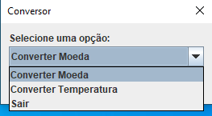
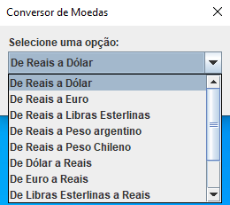
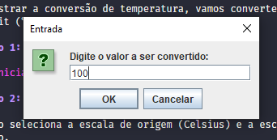
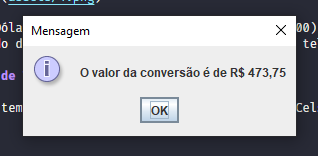
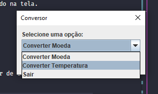
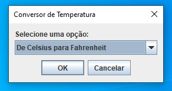
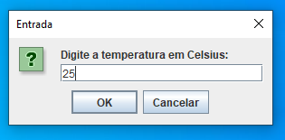
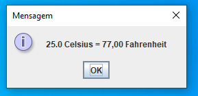
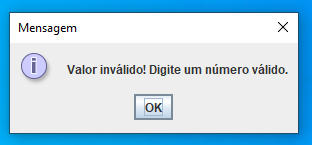
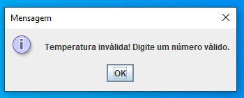

# Conversor de Moeda e Temperatura em Java

## Descrição do Projeto

Bem-vindo ao nosso desafio do Conversor de Moeda e Temperatura em Java!

Este projeto consiste em uma aplicação que permite ao usuário realizar duas principais funcionalidades:

1. **Conversão de Moedas:** O usuário pode converter valores monetários entre diferentes moedas, como Dólar, Euro, Libra Esterlina, Peso Argentino e Peso Chileno para Reais (BRL) e vice-versa.

2. **Conversão de Temperatura:** O usuário pode converter temperaturas entre as escalas Kelvin, Celsius e Fahrenheit, tornando a aplicação versátil e útil em diferentes contextos.

## Tecnologias Utilizadas

- Linguagem de Programação: Java
- Bibliotecas: Standard Library do Java
- Biblioteca externa:  org.json
- API externa para obter as taxas de câmbio atualizadas - ( `https://economia.awesomeapi.com.br`)

## Demonstração de Conversão de Moeda

Para ilustrar a conversão de moeda, vamos converter um valor de Dólar (USD) para Reais (BRL).

### Passo 1: Tela Inicial

### Passo 2: Selecionar a Moeda de Origem e Destino

O usuário seleciona a moeda de origem (Dólar) e a moeda de destino (Reais) para a conversão.

### Passo 3: Inserir o Valor e Realizar a Conversão

O usuário insere o valor em Dólar a ser convertido (por exemplo, $100.00) e pressiona o botão "Converter". O resultado da conversão para Reais será exibido na tela.

### Passo 4: Eis a saida do programa com a devida conversão

O programa realiza uma consulta na api para realizar a conversão
## Demonstração de Conversão de Temperatura

Para ilustrar a conversão de temperatura, vamos converter um valor de Celsius (°C) para Fahrenheit (°F).

### Passo 1: Na tela Inicial

### Passo 2: Selecionar a Escala de Origem e Destino

O usuário seleciona a escala de origem (Celsius) e a escala de destino (Fahrenheit) para a conversão.

### Passo 3: Inserir o Valor e Realizar a Conversão

O usuário insere o valor em Celsius a ser convertido (por exemplo, 25°C) e pressiona o botão "Converter". O resultado da conversão para Fahrenheit será exibido na tela.

### Passo 4: Validação de entrada

E caso o usuario insira uma entrada indevida, tanto para a conversão de moeda como para temperatura, surge a mensagem de infomação solicitando um valor válido.

## Principais Funções Criadas

Algumas das principais funções desenvolvidas neste projeto:

1. `atualizarCotacoes()`: Atualiza as cotações de moeda através de uma API externa.
2. `converterMoeda()`: Realiza a conversão entre moedas, considerando Reais como intermediário.
3. `converterRealParaMoeda()`: Converte um valor em Reais para a moeda desejada.
4. `converterMoedaParaReal()`: Converte um valor em moeda estrangeira para Reais.
5. `formatarValor()`: Formata o valor monetário para exibição com símbolo da moeda adequado.

O código foi desenvolvido de forma modular e organizada para facilitar a manutenção e expansão do projeto.

